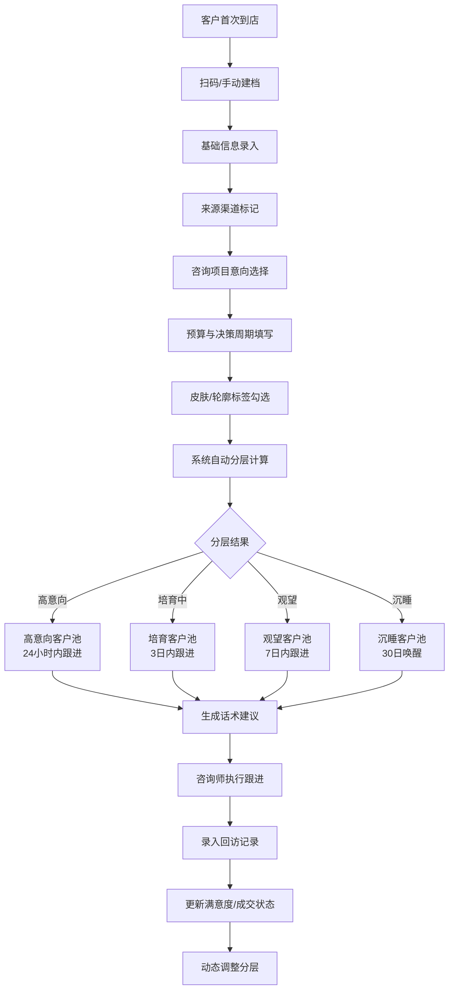

## 1. 产品概述

医美求美者标签分层管理工作台，专为连锁医美机构咨询师打造，核心解决首次到店后跟进混乱、客户分层不清、转化效率低的运营痛点。

- 核心用户：医美咨询师、门店主管、运营总监
- 核心价值：通过标准化标签体系和自动化分层算法，实现客户全生命周期可视化管理，提升首次到店转化率与复购率

---

## 2. 核心功能

### 2.1 用户角色

| 角色 | 登录方式 | 核心权限 |
|------|----------|----------|
| 咨询师 | 工号登录 | 录入客户、打标签、跟进任务、回访记录、查看个人客户池 |
| 门店主管 | 工号登录 | 查看全店看板、超期未跟进预警、转化数据分析、咨询师业绩对比 |
| 运营总监 | 工号登录 | 多店数据汇总、渠道ROI分析、分层趋势洞察 |

### 2.2 功能模块

1. **客户录入**：扫码建档、基础信息、来源渠道、咨询项目、预算区间、决策周期
2. **标签画像**：皮肤/轮廓关注点、心理特征标签、消费能力、成交概率评分
3. **分层看板**：高意向/培育中/观望/沉睡四层客户池、到店热度热力图
4. **跟进任务**：待跟进列表、超期提醒、话术建议、任务完成标记
5. **回访记录**：复诊提醒、术后满意度、未成交原因归类、成交结果更新

### 2.3 页面详情

| 页面名称 | 模块名称 | 功能描述 |
|----------|----------|----------|
| 客户录入页 | 扫码建档区 | 二维码扫描、手机号快速建档、重复客户检测 |
| 客户录入页 | 基础信息表单 | 姓名、性别、年龄、联系方式、过敏史填写 |
| 客户录入页 | 渠道与意向 | 来源渠道下拉（抖音/小红书/朋友介绍/地推/自然到店）、咨询项目多选、预算区间滑块、决策周期选择 |
| 标签画像页 | 关注点标签矩阵 | 皮肤类（色斑/痘痘/敏感/松弛/暗沉）、轮廓类（瘦脸/隆鼻/双眼皮/下巴/填充）多选标签组 |
| 标签画像页 | 成交评分卡片 | 预算×意向× urgency 三维度自动计算成交概率（高/中/低）、显示核心驱动因素 |
| 标签画像页 | 客户画像雷达 | 消费能力、 urgency 程度、审美认知、配合度、决策复杂度五维雷达图 |
| 分层看板页 | 四象限分层池 | 高意向（红）、培育中（橙）、观望（黄）、沉睡（灰）四色卡片瀑布流，支持拖拽调整 |
| 分层看板页 | 咨询师业绩条 | 每位咨询师的高价值客户数、7日跟进率、本月转化率横向条形对比 |
| 分层看板页 | 超期预警面板 | 红色高亮显示超过3天未跟进客户名单、一键分配跟进 |
| 跟进任务页 | 今日待办列表 | 按优先级排序的跟进卡片、客户基本信息、上次跟进摘要、建议话术气泡 |
| 跟进任务页 | 任务详情弹窗 | 跟进方式选择（微信/电话/到店）、跟进记录输入、下次跟进时间设置 |
| 回访记录页 | 复诊时间轴 | 术前/术中/术后时间节点、满意度星级、并发症记录 |
| 回访记录页 | 未成交原因库 | 价格敏感/效果顾虑/家人反对/对比别家/暂无预算 五类原因统计饼图 |
| 回访记录页 | 成交状态更新 | 已成交/部分成交/未成交切换、成交金额填写、项目清单 |

---

## 3. 核心流程

咨询师接待流程：客户首次到店 → 扫码或手动录入基础信息 → 面诊勾选关注点标签 → 填写预算与决策周期 → 系统自动计算成交概率并分配分层 → 生成首次跟进话术建议 → 咨询师按任务节奏跟进 → 记录回访结果 → 动态调整客户分层。

---

## 4. 用户界面设计

### 4.1 设计风格

**医美精致专业风**：
- 主色：玫瑰金渐变 `#D4A574 → #B8956E`（高端质感）
- 辅助色：柔和蜜桃粉 `#FFE5E0`、深墨蓝 `#1E2A4A`（专业稳重）
- 强调色：珊瑚红 `#FF6B6B`（高意向警示）、薄荷绿 `#4ECDC4`（成交标记）
- 按钮风格：圆角 8px，主按钮使用玫瑰金渐变 + 微阴影
- 字体：标题用 `Noto Serif SC`（优雅衬线），正文用 `PingFang SC`（清晰易读）
- 卡片布局：大圆角（16px）+ 柔和投影 + 微妙悬浮动效
- 图标风格：线性细描边 + 玫瑰金配色，医疗感与时尚感平衡
- 背景：极浅米白 `#FFFAF7` + 右上角淡雅玫瑰金光晕装饰

### 4.2 页面设计概览

| 页面名称 | 模块名称 | UI 元素 |
|----------|----------|---------|
| 客户录入 | 表单区 | 左侧分步进度条 + 右侧大表单卡片，标签用圆角胶囊样式，预算用双滑块组件 |
| 标签画像 | 画像卡 | 左侧头像+基本信息侧栏，中间雷达图+标签矩阵，右侧成交概率仪表盘带呼吸光效 |
| 分层看板 | 四象限 | 顶部标签页切换（全部/我负责），四列瀑布流卡片，高意向卡片带脉冲红边框动画 |
| 跟进任务 | 待办列表 | 时间轴式布局，左侧优先级色块（红/橙/黄/灰），卡片hover展开话术建议气泡 |
| 回访记录 | 时间轴 | 垂直时间轴节点用不同颜色区分阶段，满意度星级打分组件带悬停反馈 |

### 4.3 响应式

- **桌面端优先**：主内容区 1440px 栅格布局，侧边导航 240px 固定
- **平板适配**：≥1024px 保持完整布局，卡片自动换行
- **手机适配**：≥375px 侧边栏收为底部 Tab 栏，看板从四列变单列滚动
- 触摸优化：按钮最小尺寸 44×44px，标签触控区域加大

