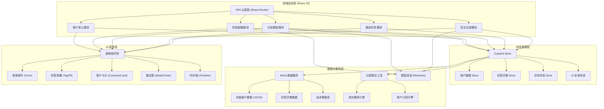
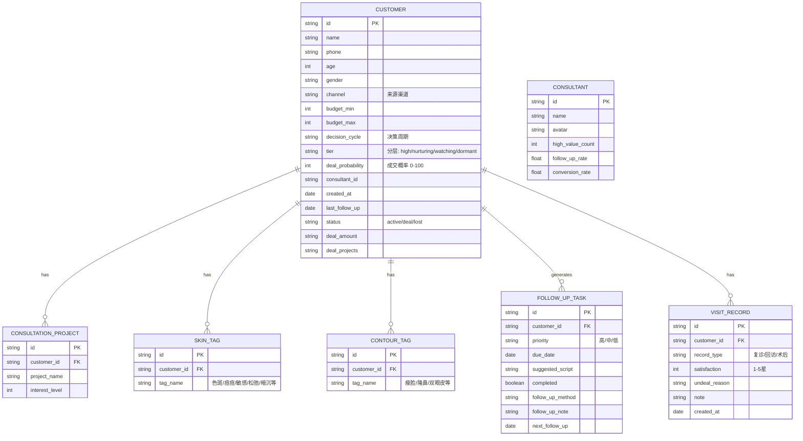

## 1. 架构设计



---

## 2. 技术说明

- **前端框架**：React@18 + React Router@6（SPA 多页面路由）
- **构建工具**：Vite@5（快速 HMR 与构建）
- **样式方案**：TailwindCSS@3 + 自定义 CSS 变量主题
- **状态管理**：Zustand@4（轻量、无需 Provider 包裹）
- **UI 组件**：Headless UI（无样式可访问组件）+ Lucide React（图标库）
- **图表渲染**：Recharts@2（雷达图、饼图、条形图）
- **动画效果**：Framer Motion@11（页面切换、卡片悬浮、脉冲动效）
- **后端方案**：无后端，使用前端 Mock 数据 + localStorage 持久化
- **数据持久化**：localStorage 存储客户数据与任务状态
- **字体方案**：Google Fonts Noto Serif SC + PingFang SC

---

## 3. 路由定义

| 路由路径 | 页面用途 |
|----------|----------|
| `/` | 重定向至 `/dashboard` |
| `/customers/entry` | 客户录入页：新建/编辑客户基础信息 |
| `/customers/:id/profile` | 客户标签画像页：标签矩阵、雷达图、成交概率 |
| `/dashboard` | 分层看板页：四象限客户池、业绩条、超期预警 |
| `/tasks` | 跟进任务页：待办列表、话术提示、任务弹窗 |
| `/records` | 回访记录页：复诊时间轴、满意度、成交状态 |

---

## 4. 数据模型

### 4.1 ER 图



### 4.2 数据字典（前端常量）

**来源渠道 (channels)**
```
["抖音", "小红书", "朋友介绍", "地推", "自然到店", "美团", "大众点评", "微博"]
```

**咨询项目 (projects)**
```
["玻尿酸填充", "瘦脸针", "热玛吉", "光子嫩肤", "双眼皮", "隆鼻", "下颌线提升", "祛斑", "祛痘", "水光针", "线雕", "脂肪填充"]
```

**决策周期 (decision_cycles)**
```
[
  { value: "urgent", label: "1周内", days: 7 },
  { value: "short", label: "1个月内", days: 30 },
  { value: "medium", label: "3个月内", days: 90 },
  { value: "long", label: "半年以上", days: 180 }
]
```

**皮肤标签 (skin_tags)**
```
["色斑", "痘痘", "敏感", "松弛", "暗沉", "毛孔粗大", "红血丝", "细纹", "痘印", "肤色不均"]
```

**轮廓标签 (contour_tags)**
```
["瘦脸", "隆鼻", "双眼皮", "下巴", "苹果肌", "太阳穴", "法令纹", "下颌线", "额头", "唇形"]
```

**未成交原因 (undeal_reasons)**
```
["价格敏感", "效果顾虑", "家人反对", "对比别家", "暂无预算", "怕疼/怕风险", "距离远", "等待活动"]
```

### 4.3 分层算法规则

```typescript
// 成交概率计算 (0-100)
function calculateDealProbability(customer): number {
  let score = 0
  // 预算匹配度 (满分30)
  score += budgetScore(customer.budget_min, customer.budget_max) // 0-30
  // 决策 urgency (满分25)
  score += urgencyScore(customer.decision_cycle) // 0-25
  // 项目意向数 (满分20)
  score += Math.min(customer.projects.length * 5, 20)
  // 标签丰富度 (满分15)
  score += Math.min((customer.skin_tags.length + customer.contour_tags.length) * 2, 15)
  // 来源渠道质量 (满分10)
  score += channelScore(customer.channel) // 0-10
  return Math.min(score, 100)
}

// 分层映射
function assignTier(probability: number, lastFollowDays: number): string {
  if (probability >= 70) return "high"        // 高意向
  if (probability >= 45) return "nurturing"   // 培育中
  if (probability >= 20) return "watching"    // 观望
  if (lastFollowDays > 30) return "dormant"   // 沉睡
  return "watching"
}
```

